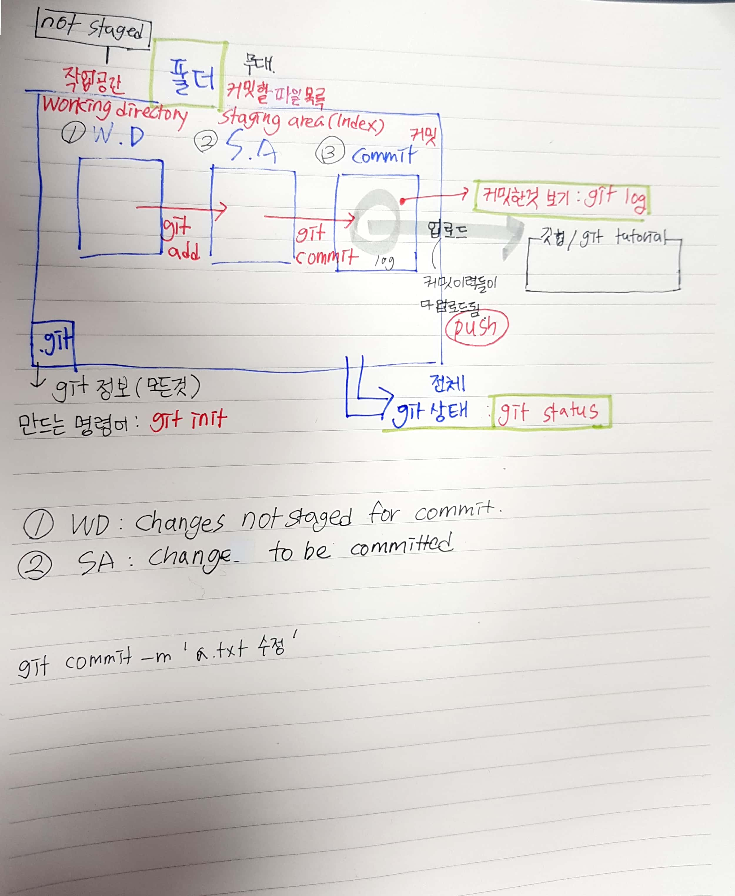

# Git

> Git은 분산버전관리시스템(DVCS)의 일종이다.
>
> 소스코드의 이력을 남기고 관리할 수 있다. 

## 준비사항

윈도우에서 git을 쓰기 위해서는 [git bash](https://gitforwindows.org/)를 설치한다.

컴퓨터에 처음 설치하는 경우, 커밋을 작성하는 사람(author)를 global로 설정을 해야한다.

```bash
$ git config --global user.name. skmoon
$ git config --global user.email. kiikis622@gmail.com
```



 

## 로컬 저장소 활용하기 

### 1. 저장소 생성

```bash
$ git init
Initialized empty Git repository in C:/Users/HPE/Desktop/TIL/.git/
```

* git 저장소를 생성하면, 해당 디렉토링 .git 폴더가 생성된다. 
* (master)는 현재 작업 중인 브랜치가 master라는 의미를 가지고 있다.


### 2.add

* working directory(작업공간)에서 staging area로 해당 파일을 이동시키기 위해서는 아래의 명령어를 사용한다.

```bash
$ git add markdown.md # 특정파일
$ git add images/ # 특정 폴더
$ git add . #현재 디렉토리
```

* 
  * ADD 전상태

```bash
HPE@DESKTOP-DFE1UPJ MINGW64 ~/Desktop/TIL (master)
$ git status
On branch master

No commits yet
# 트래킹이 되지 않고 있는 파일듯
# => commit 이력에 한번도 저장되지 않은 파일들, 즉 새로 생성된 파일.
Untracked files:
# 커밋이 될 것들에 포함시키기 위해서는 add
# => staging area에 담으려면 add
  (use "git add <file>..." to include in what will be committed)
        "Git \355\212\271\352\260\225 \354\240\225\353\246\254.md"
        images/
        markdown.md

nothing added to commit but untracked files present (use "git add" to track)

```

 * 
   	* ADD 후 상태

```bash
$ git status
On branch master

No commits yet
# 커밋이 될 변경 사항들
# => staging area에 있는 파일들 
Changes to be committed:
  (use "git rm --cached <file>..." to unstage)
  # git rm 하면 staging area에서 working directory로 돌아감.
        new file:   markdown.md
# working directory에 있는 파일들
Untracked files:
  (use "git add <file>..." to include in what will be committed)
        "Git \355\212\271\352\260\225 \354\240\225\353\246\254.md"
        images/

```


### 3. commit

* 이력을 남기기 위해서는 아래의 명령어를 활용한다.

```bash
$ git commit -m 'markdown 활용법 추가'
[master (root-commit) 6111a7f] markdown 활용법 추가
 1 file changed, 125 insertions(+)
 create mode 100644 markdown.md
```

* 커밋메시지는 해당 이력을 나타낼 수 있도록 작성하는 것이 중요하고 항상 일관적으로 작성하자.

* 커밋메세지는 아래의 명령어로 확인 가능하다.

```bash
$git log
$git log --oneline
$git log -1

HPE@DESKTOP-DFE1UPJ MINGW64 ~/Desktop/TIL (master)
$ git log
commit 6111a7f5408ab798a7767b2d462cdeb135de37ce (HEAD -> master)
Author: skmoon <star3qp@naver.com>
Date:   Fri Dec 27 14:19:09 2019 +0900

    markdown 활용법 추가

HPE@DESKTOP-DFE1UPJ MINGW64 ~/Desktop/TIL (master)
$ git log --oneline
6111a7f (HEAD -> master) markdown 활용법 추가

HPE@DESKTOP-DFE1UPJ MINGW64 ~/Desktop/TIL (master)
$ git log -1
commit 6111a7f5408ab798a7767b2d462cdeb135de37ce (HEAD -> master)
Author: skmoon <star3qp@naver.com>
Date:   Fri Dec 27 14:19:09 2019 +0900

    markdown 활용법 추가

```


* 커밋메시지 참고 | [toast meetup]([https://meetup.toast.com ' posts](https://meetup.toast.com/posts/106)),  [좋은 커밋메시지]([https://blog.ull.im ' engineering ' 2019/03/10 ' logs-on-git](https://blog.ull.im/engineering/2019/03/10/logs-on-git.html))


## 원격 저장소(remote repository) 활용하기

> 원격 저장소를 제공하는 서비스는 gitlab, github, bitbucket 등 다양하나 github을 기준으로 설명한다.

### 1. 원격저장소 설정하기

```bash
$ git remote add origin github_url
```

* 원격저장소(`remote`)를 `origin` 이름으로  `github_url`을 추가(`add`)한다.
* 설정된 원격 저장소 목록을 확인하기 위해서는 아래의 명령어를 활용한다.

```bash
$ git remote -v
origin  https://github.com/sk-moon/TIL.git (fetch)
origin  https://github.com/sk-moon/TIL.git (push)
```

* 설정된 원격 저장소를 삭제하기 위해서는 아래의 명령어를 활용한다.

```bash
$ git remote rm origin
```

